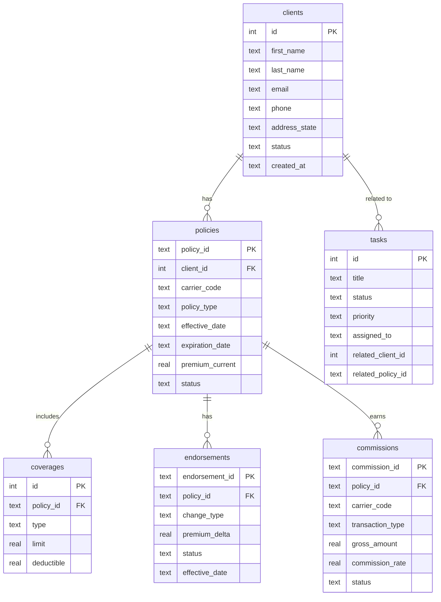
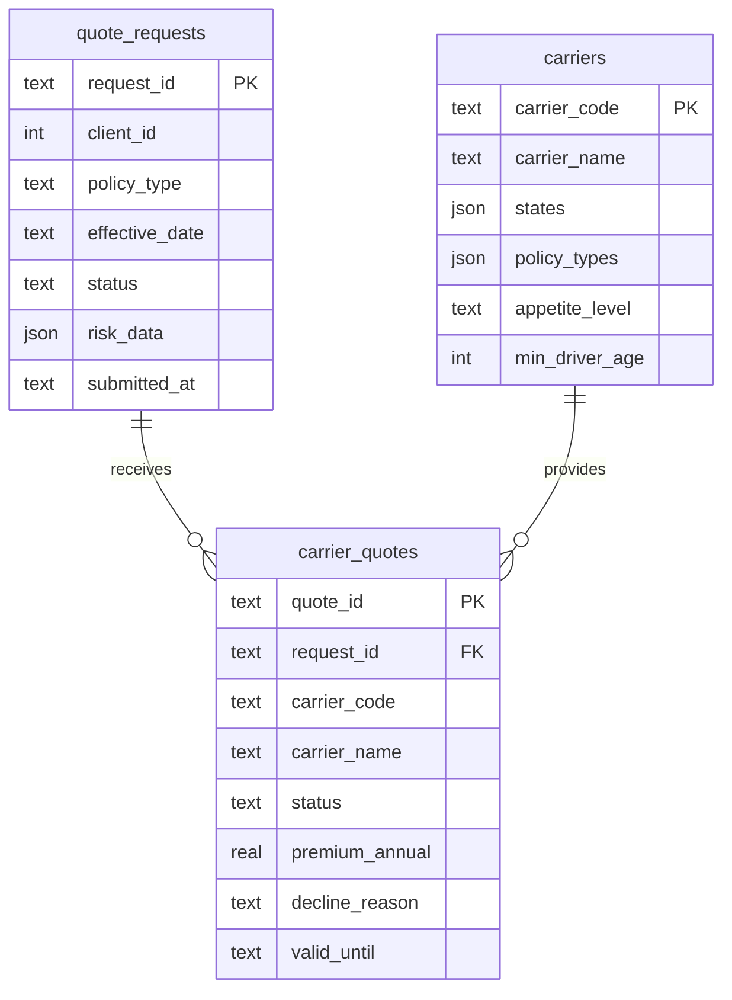
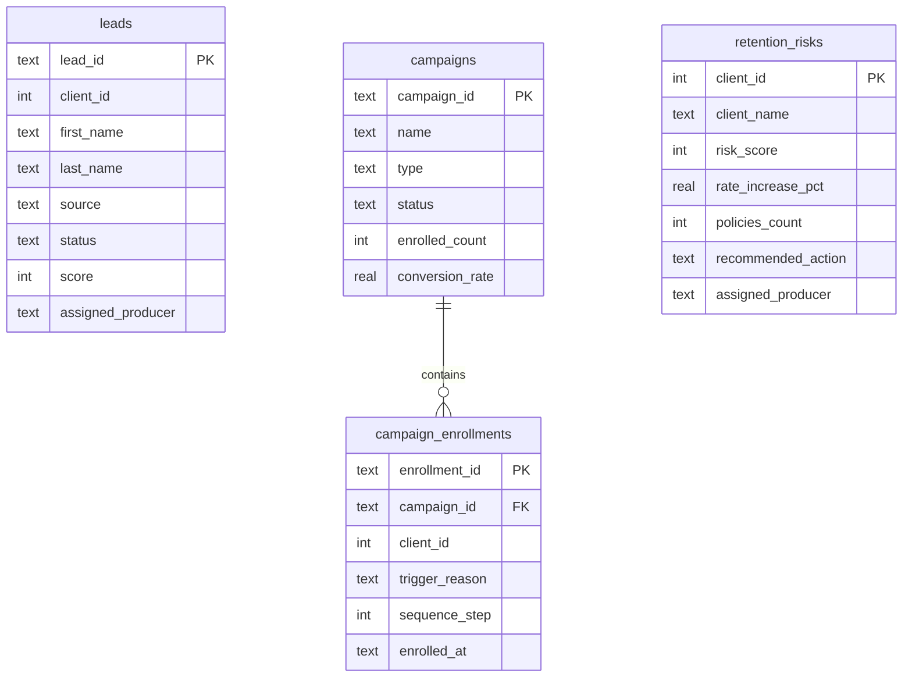
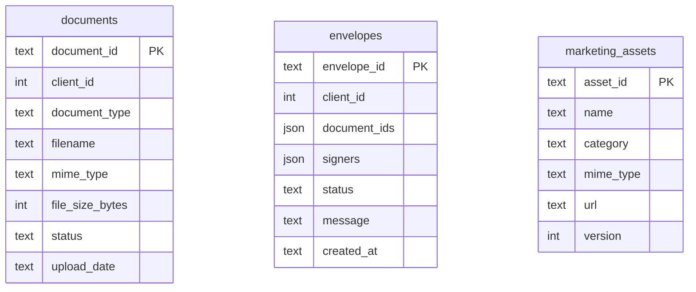
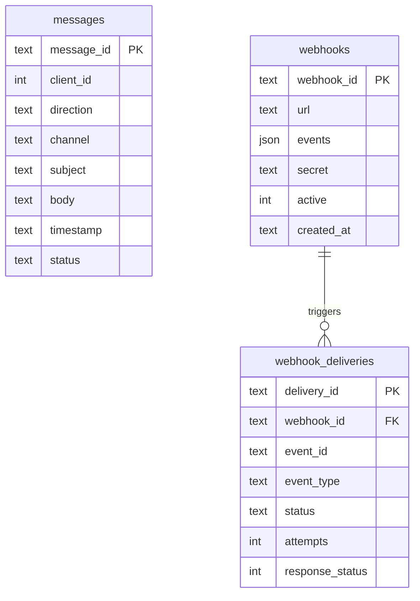
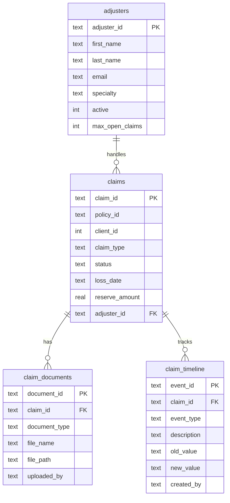
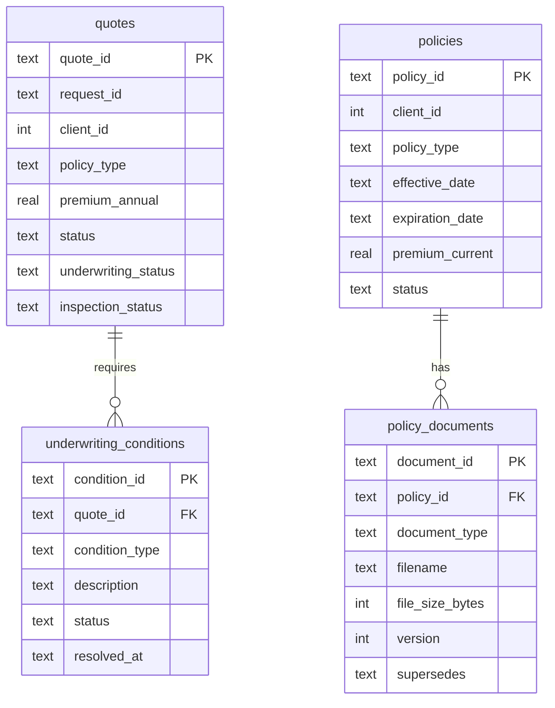
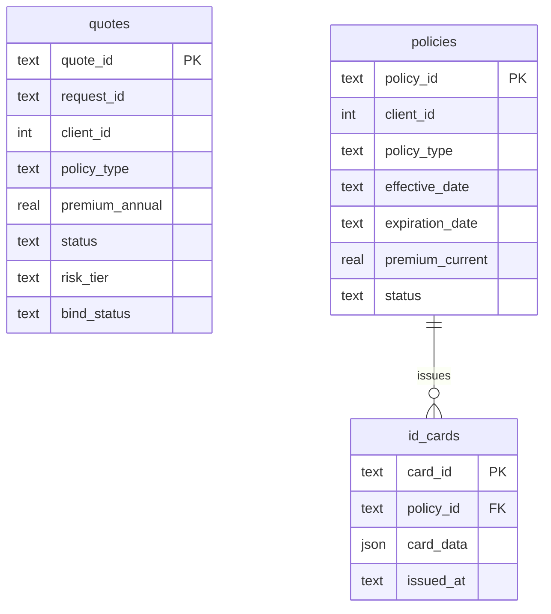

# Data Models

This document contains Mermaid ER diagrams for the database schemas across all services in the insurance platform. Each service maintains its own SQLite database. Cross-service references (e.g., `client_id`, `policy_id`) are soft references rather than enforced foreign key constraints.

Key columns are shown per table to keep diagrams readable; refer to the source schema files for the complete column list.

---

## AMS Service

Agency Management System -- clients, policies, coverages, endorsements, commissions, and tasks.

---

## Rater Service

Quoting engine -- manages quote requests, carrier responses, and carrier appetite configuration.

---

## CRM Service

Customer Relationship Management -- leads, campaigns, enrollments, and retention risk tracking.

---

## ECM Service

Enterprise Content Management -- document storage, e-signature envelopes, and marketing assets.

---

## Comm Service

Communications -- messages across channels, webhook subscriptions, and delivery tracking.

---

## Claims Service

Claims processing -- claims intake, adjuster assignment, document uploads, and timeline events.

---

## Carrier-Summit Service

Summit Fire & Casualty carrier portal -- property-focused quoting, underwriting conditions, policies, and documents.

---

## Carrier-Coastal Service

Coastal Star Insurance carrier portal -- auto-focused quoting with risk scoring, policies, and ID cards.

---

## Cross-Service Relationships

The following diagram illustrates the soft references that link data across service boundaries. These are not enforced foreign keys -- each service owns its own database and references entities in other services by convention.

```mermaid
erDiagram
    %% Soft references across service boundaries

    AMS_clients {
        int id PK
        text name
    }
    AMS_policies {
        text policy_id PK
        int client_id FK
    }
    Rater_quote_requests {
        text request_id PK
        int client_id
    }
    Rater_carrier_quotes {
        text quote_id PK
        text request_id FK
    }
    CRM_leads {
        text lead_id PK
        int client_id
    }
    CRM_campaign_enrollments {
        text enrollment_id PK
        int client_id
    }
    CRM_retention_risks {
        int client_id PK
    }
    ECM_documents {
        text document_id PK
        int client_id
    }
    ECM_envelopes {
        text envelope_id PK
        int client_id
    }
    Comm_messages {
        text message_id PK
        int client_id
    }
    Claims_claims {
        text claim_id PK
        text policy_id
        int client_id
    }
    Summit_quotes {
        text quote_id PK
        int client_id
        text request_id
    }
    Summit_policies {
        text policy_id PK
        int client_id
    }
    Coastal_quotes {
        text quote_id PK
        int client_id
        text request_id
    }
    Coastal_policies {
        text policy_id PK
        int client_id
    }

    AMS_clients ||--o{ AMS_policies : "owns"
    AMS_clients ||--o{ Rater_quote_requests : "client_id"
    AMS_clients ||--o{ CRM_leads : "client_id"
    AMS_clients ||--o{ CRM_campaign_enrollments : "client_id"
    AMS_clients ||--o{ CRM_retention_risks : "client_id"
    AMS_clients ||--o{ ECM_documents : "client_id"
    AMS_clients ||--o{ ECM_envelopes : "client_id"
    AMS_clients ||--o{ Comm_messages : "client_id"
    AMS_clients ||--o{ Claims_claims : "client_id"
    AMS_clients ||--o{ Summit_quotes : "client_id"
    AMS_clients ||--o{ Summit_policies : "client_id"
    AMS_clients ||--o{ Coastal_quotes : "client_id"
    AMS_clients ||--o{ Coastal_policies : "client_id"
    AMS_policies ||--o{ Claims_claims : "policy_id"
    Rater_quote_requests ||--o{ Rater_carrier_quotes : "request_id"
    Rater_quote_requests ||--o{ Summit_quotes : "request_id"
    Rater_quote_requests ||--o{ Coastal_quotes : "request_id"
```

